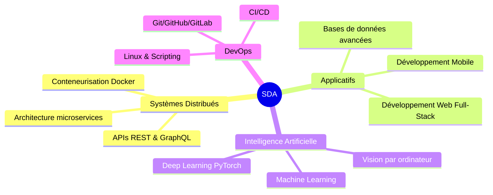

<div align="center">

```
██████╗ ██████╗  █████╗ ██╗  ██╗██╗███╗   ███╗
██╔══██╗██╔══██╗██╔══██╗██║  ██║██║████╗ ████║
██████╔╝██████╔╝███████║███████║██║██╔████╔██║
██╔══██╗██╔══██╗██╔══██║██╔══██║██║██║╚██╔╝██║
██████╔╝██║  ██║██║  ██║██║  ██║██║██║ ╚═╝ ██║
╚═════╝ ╚═╝  ╚═╝╚═╝  ╚═╝╚═╝  ╚═╝╚═╝╚═╝     ╚═╝
```

# 👋 Brahim EL BAHLOUL

### 🎓 Master SDA — FPS Safi & EST Safi (Formation Commune)
### 💡 Développeur Passionné · Data & Systèmes Distribués · IA & Mobile

[](https://git.io/typing-svg)

</div>

---

## 🧑‍💻 À propos de moi

```yaml
name: Brahim EL BAHLOUL
formation: Master Systèmes Distribués et Applicatifs (SDA)
établissements:
  - Faculté Polydisciplinaire de Safi (FPS)
  - École Supérieure de Technologie de Safi (EST)
localisation: Safi, Maroc 🇲🇦
statut: Étudiant Master 2ème année
interêts:
  - Systèmes Distribués & Cloud
  - Intelligence Artificielle & Machine Learning
  - Développement Mobile (Android/Flutter)
  - Développement Web Full-Stack
  - DevOps & Containerisation
objectif: Concevoir des solutions logicielles robustes, scalables et intelligentes
```

---

## 📊 Statistiques GitHub

<div align="center">
  
  
</div>

<div align="center">
  
</div>

---

## 🛠️ Stack Technique

### 🌐 Développement Web


### 📱 Développement Mobile


### 🤖 IA / Data Science


### 🖥️ Programmation Système & Backend


### 🗄️ Bases de Données


### ☁️ DevOps & Outils


---

## 🎓 Formation Académique

| 🏫 Établissement | 📚 Diplôme | 📅 Période |
|---|---|---|
| FPS Safi + EST Safi | Master SDA — Systèmes Distribués & Applicatifs *(En cours)* | 2023 – Présent |
| EST / FPS Safi | Licence / DUT Informatique | Avant 2023 |

> 🤝 **Master Commun** entre la **Faculté Polydisciplinaire de Safi** et l'**École Supérieure de Technologie de Safi**, spécialité Systèmes Distribués et Applicatifs.

---

## 🚀 Domaines de Compétences (Master SDA)



---

## 📫 Me Contacter

<div align="left">

[](https://instagram.com/)
[](https://discord.com/)
[](mailto:brahimcode604@gmail.com)
[](https://linkedin.com/)

</div>

---

## 🐍 Contribution Graph

<div align="center">
  
</div>

---

<div align="center">

### 💬 Citation du jour

> *"Le code est comme l'humour. Quand on doit l'expliquer, c'est qu'il est mauvais."*
> — Cory House

---


⭐️ **Si mes projets vous plaisent, n'hésitez pas à les étoiler !**

</div>